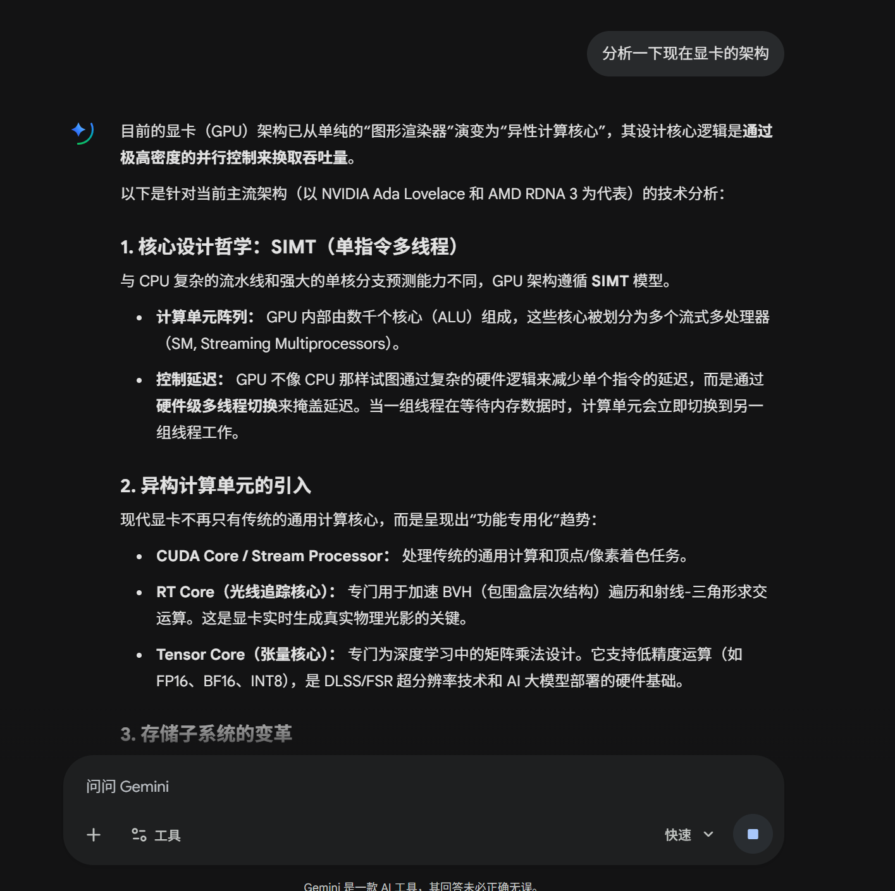
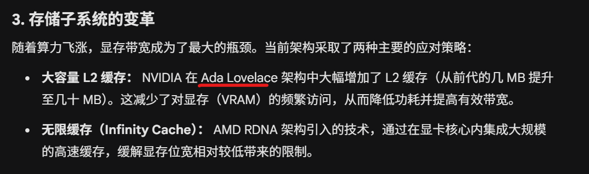
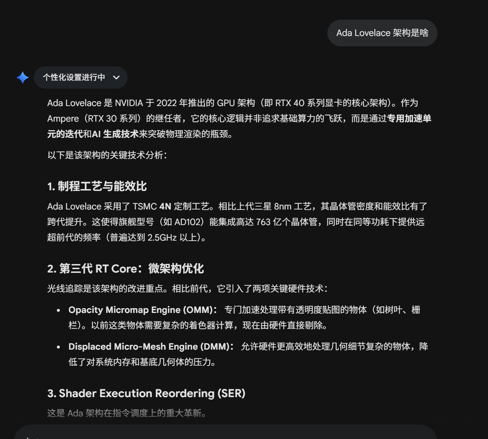
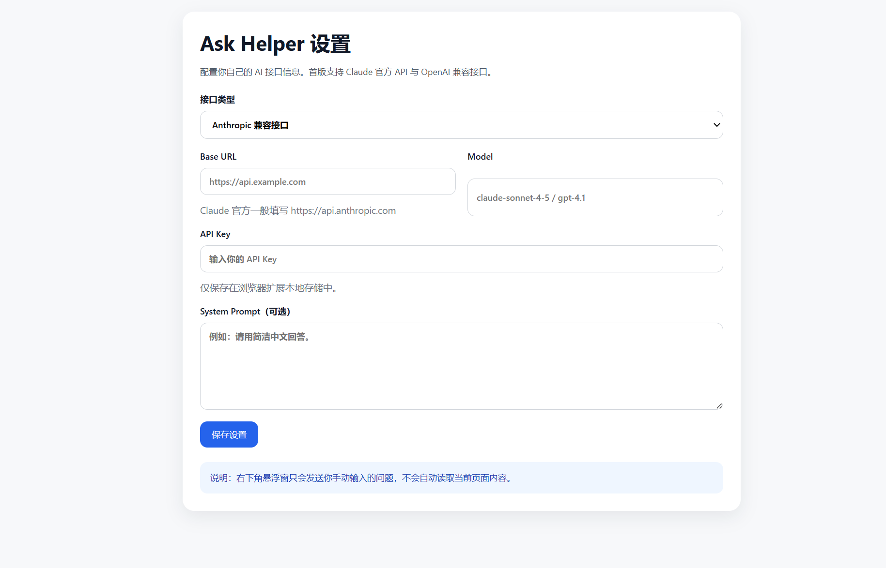

# Vibe Coding实现了一个AI聊天小插件..

不知道大家有没有遇到过这样的情况

向ai提问并阅读ai返回的内容时，可能我们看到一半，出现一个我们不认识的概念

(Ada Lovelace是啥玩意？？)

我们想知道这是啥，就得接着问ai

这一个问题还好，可是如果中间出现了多个我们看不懂得概念呢。。

我们就得接着在这个窗口去问ai

但是如果问题越来越多，我们看完了回答之后想要回到最开始的位置就不得不使劲的滚动鼠标，往上翻到最开始的聊天记录

这非常的令人烦躁，而且可能我们要找的最开始的对话是中间的某次记录，这样的话更难定位了。。

或许你会说，我一个问题一个开一个新的聊天窗口不就行了？

但如果你开的窗口越来越多，你可能都找不到你原来的那个窗口所在的位置了。。。

因为我之前使用ai的时候经常被这个困扰，所以我就vibe了一个插件，一个ai对话悬浮窗，可以随时向它提问

这样就不必在意新的聊天记录会淹没最开始的记录了！

目前只支持第三方接入
支持anthropic格式和openai格式
项目开源在github

<https://github.com/LennyFace24/AskHelper>
